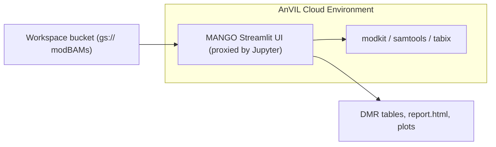

# Running MANGO as an interactive app inside AnVIL / Terra

This directory packages MANGO so it runs **inside** your AnVIL (Terra) workspace:
you pull the trio's modBAMs straight from the workspace's Google Cloud Storage
bucket, run the same Streamlit UI, and get the same plots — all within AnVIL's
security and billing boundary, with nothing downloaded to your laptop.

There are two ways to use MANGO on AnVIL. This folder covers the **interactive
app**; the `wdl/` folder (if present) covers the batch **workflow** route, which
is better for genome-wide runs on very large BAMs.



## How the AnVIL connection works

- The new **"AnVIL data"** page (`app/pages/0_AnVIL_Data.py`) browses your
  workspace bucket or accepts pasted `gs://` paths (for example the values from a
  Data Table column), localizes the BAMs (and their `.bai`/`.csi` indexes) into a
  folder, and registers that folder so it is selectable on the **Setup** page.
- All Google access uses `gsutil`, which is pre-installed and pre-authenticated
  in every Terra Cloud Environment — no service-account key is needed.
- GREGoR release buckets are **requester-pays**, so reads are billed to your own
  Terra billing project. MANGO reads that project from `GOOGLE_PROJECT`
  automatically and passes it as `gsutil -u <project>`; you can override it on the
  page. You must be running from a workspace where you have a billing project.

## Deploy it (custom Cloud Environment)

1. **Build and push the image** to a registry Terra can pull from (Artifact
   Registry / GCR in your Google project, or any public registry). Run from the
   repository root:

   ```bash
   docker build -f anvil/Dockerfile -t <REGION>-docker.pkg.dev/<PROJECT>/<REPO>/mango-anvil:latest .
   docker push <REGION>-docker.pkg.dev/<PROJECT>/<REPO>/mango-anvil:latest
   ```

2. **Create a custom Cloud Environment** in your AnVIL workspace: open the
   Cloud Environment (cloud icon) → the Jupyter/environment settings →
   **Custom Environment / "Custom image"**, and paste the image URI above.

3. **Launch and open MANGO.** Once the environment starts, open the Jupyter
   Launcher — **MANGO** appears as a tile (served at `.../proxy/mango/` via
   `jupyter-server-proxy`). Then:
   - Go to **0. AnVIL data**, confirm the detected bucket + billing project,
     browse or paste the trio's `gs://` BAM paths, and download them.
   - Continue to **Setup → Regions → Thresholds → Run → Results** exactly as in
     the desktop app.

4. **Persist outputs to AnVIL.** On the **Run** page choose an output folder
   under your workspace bucket mount (e.g. the persistent-disk or bucket path
   exposed in the environment) so results and `report.html` stay in AnVIL.

## Notes and caveats

- Leonardo's exact requirements for custom images and the proxy base path can
  vary by Terra release; if the Launcher tile or `.../proxy/mango/` path needs
  adjustment, tweak `app/jupyter_proxy.py` (the `--server.baseUrlPath`) and the
  `CMD` in `anvil/Dockerfile`. The image also runs standalone for local testing:

  ```bash
  docker build -f anvil/Dockerfile -t mango-anvil:local .
  docker run --rm -p 8888:8888 mango-anvil:local
  # then open the printed Jupyter URL and launch MANGO from the Launcher
  ```

- For very large genome-wide BAMs, prefer the WDL workflow route (no in-app
  download); the interactive app is ideal for targeted gene-panel trios.
- To share the workflow with the consortium via Dockstore under the GREGoR
  organization, use the WDL route and contact the DCC to be added to the org.
